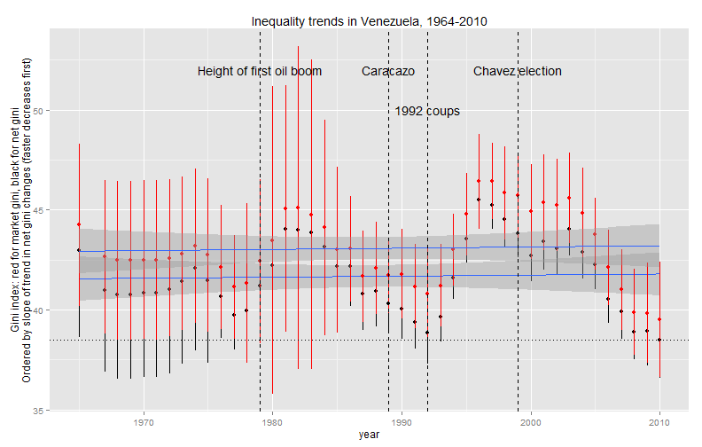
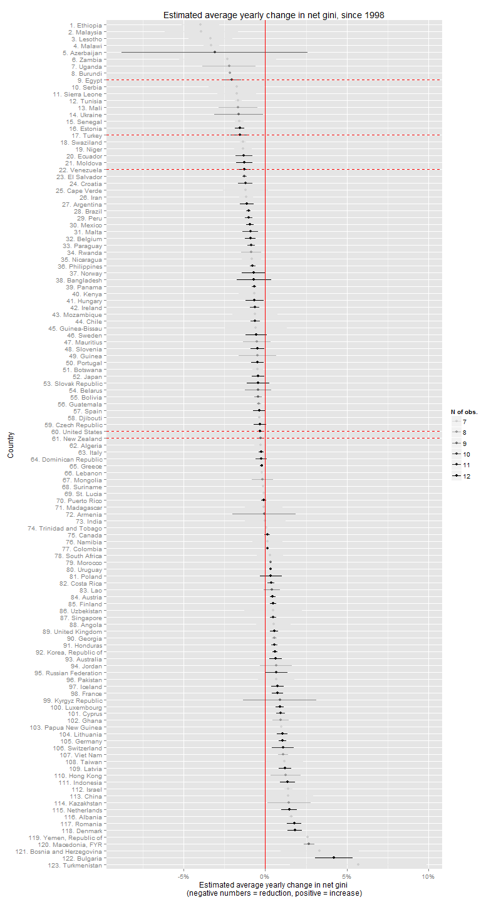
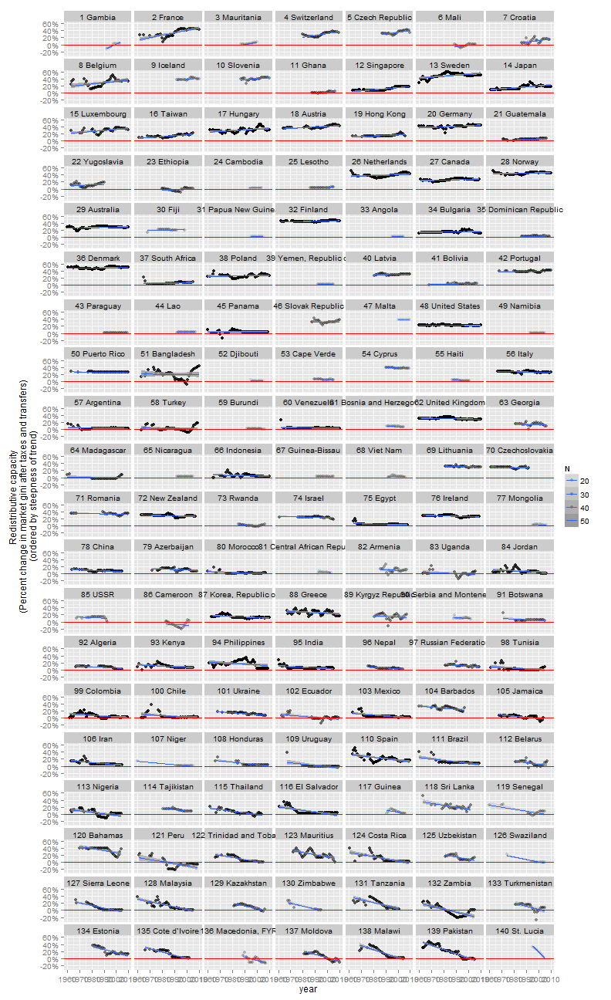
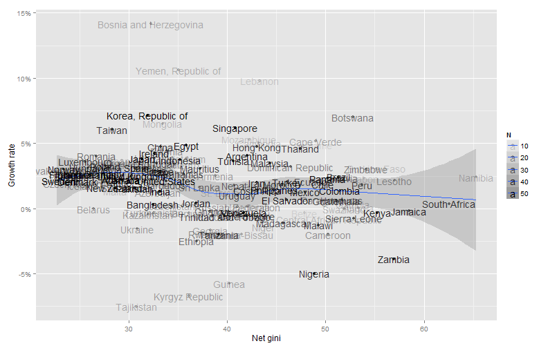

Inequality Regimes and Rawlsian Growth Rates: Some thoughts on the evolution of inequality 1960-2010, with special reference to Venezuela
========================================================

(Mostly an excuse to play with the [Standardized Worldwide Income Inequality Database](http://myweb.uiowa.edu/fsolt/swiid/swiid.html), compiled by [Frederick Solt](http://myweb.uiowa.edu/fsolt/), which I just discovered. This post also belongs, loosely speaking, to my [long-running series on the quantitative history of political regimes](http://abandonedfootnotes.blogspot.co.nz/search/label/history%20of%20political%20regimes). R code for everything in this blogpost available in this [Git repository](https://github.com/xmarquez/Inequality_Regimes); you would need to download the dataset separately)

Inequality is difficult to measure. Socially relevant inequalities are manifold, and measurable inequalities in money income are not always especially important. (In the formerly communist states of Eastern Europe income was very evenly distributed; yet this did not mean that there were no important social inequalities). Even inequality in money income is not easy to measure properly. Most existing data is not very comparable accross countries or years, and it is often not even clear to what income concept the sorts of inequality measures people typically use to make a point in political discourse refer to: does it refer to after-tax, after-transfer income or to "market" income? Does it refer to individual or household income? What sorts of things are counted as "income"? How do we account for access to high-quality public services? At best, measures of income inequality are uncertain estimates of an unknown distribution of potential living standards, more or less valid for societies where "money income" is a useful proxy for the ability of people to enjoy various important goods, and of little value outside the context of a conception of a "just distribution" of these capabilities. 

Despite the fact that estimates of what is essentially a statistical abstraction often play surprisingly big roles in current political debates (cf. the debate over [The Spirit Level](http://abandonedfootnotes.blogspot.co.nz/2010/11/equality-and-domination-footnote-on.html) some years ago, or recent [concern](http://www.nzherald.co.nz/nz/news/article.cfm?c_id=1&objectid=10828941) about a rise in New Zealand's gini index), I have recently become more skeptical about the importance of *measured* income inequality in politics: whatever importance the actual distribution of incomes has for political life in a society, it has to be mediated through complicated processes that refract local lived experience through the prism of context-dependent fairness norms that are [only vaguely related](http://dartthrowingchimp.wordpress.com/2013/02/03/enough-about-inequality-and-unrest-already/), if at all, to the numbers used to measure its skewness. 

Yet I'm curious: what sorts of income inequality have in fact increased, and where? How might these changes have mattered? Enter a new and shiny dataset: the [Standardized Worldwide Income Inequality Database](http://myweb.uiowa.edu/fsolt/swiid/swiid.html), which promises to ameliorate some of these measurement problems. The database uses the [Luxembourg Income Study](http://www.lisdatacenter.org/) - very high quality income inequality data - to calibrate the much larger but less comparable United Nations University [World Income Inequality Database](http://www.wider.unu.edu/research/Database/en_GB/database/). The result: lovely long time series estimates of both the market and the after tax, after transfer (net) [gini index of inequality](http://en.wikipedia.org/wiki/Gini_coefficient), including standard errors, for 153 countries. My first though on learning about this was: graphs! (Hopefully some non-obvious facts are also involved below).


Let's start by looking at a country that has often [been cited as a great success in reducing inequality](http://en.wikipedia.org/wiki/Bolivarian_Missions): Venezuela during the Chavez years. (Also, I was there recently visiting family after a long absence, and I have a personal interest in understanding the changes that have occurred during that time). One question I've been curious about concerns the evolution of inequality in Venezuela relative to other Latin American countries, especially since the coming to power of Chavez in 1999. How do changes in inequality in Venezuela compare to changes elsewhere? 

In the following plot, we see changes in both the market ("equivalized (square root scale) household gross (pre-tax, pre-transfer) income", if you must know) and the net gini index of inequality (after tax, after transfer) in 19 Latin American countries from 1999 until 2010, ordered by the estimated rate of inequality reduction (countries that reduced inequality faster appear earlier; read the graph from right to left, top to bottom):

 


Inequality in Venezuela has indeed decreased relatively quickly since 1999 - the second fastest decrease after Ecuador, which has also had left-leaning governments (though a far more unstable political context, with five different presidents since 1998). Three things are worth noting about the context of these trends, however. 

First and most important is that this reduction in inequality is *not* driven by direct redistribution: there is barely any difference between the "market" gini index (our measure of inequality *before* taxes and transfers) and the "net" gini index (our measure of inequality *after* taxes and transfers). To the extent that the reduction in inequality is the result of government action rather than something else, it must have come about through measures like investment in human capital and labor market policies (see [Morgan and Kelly 2012](http://journals.cambridge.org/action/displayAbstract?fromPage=online&aid=8948630), ungated [here](http://web.utk.edu/~nkelly/papers/papers.html), for the proper peer-reviewed argument). This is true of all Latin American countries save for Puerto Rico (which is part of the USA in a sense) and (to a lesser extent) Brazil; indeed, redistribution in some countries (Peru) appears to have perversely *increased* inequality. 

Second, most Latin American countries have experienced reductions in inequality during this period, though most remain highly unequal. But Venezuela was *already* among the most equal countries in Latin America; in 1999, only Uruguay and Costa Rica had lower measured inequality (and the difference in net gini was within the margin of measurement error, so it should probably be disregarded). This surprised me; I had expected higher levels of inequality in Venezuela when compared to other countries, given the level of class conflict on display during the Chavez era. More surprisingly perhaps, if we take a broader look we discover that inequality in Venezuela appears to have been remarkably stable over the past fifty years, fluctuating around a flat trend:


 

(Lines around dots represent 95% confidence intervals).

In fact, the low level of inequality in Venezuela as of 2010 only returned the country to the level of inequality it last experienced around ... 1992, the year of the [February coup](http://en.wikipedia.org/wiki/Venezuelan_coup_attempt_of_1992) which made Chavez famous, and **three years** after the "neoliberal" *paquete* of 1989 (which was supposed to have triggered the [Caracazo](http://en.wikipedia.org/wiki/Caracazo)). Inequality did increase after 1992, and poverty had increased before then - the Venezuelan economy had been in decline for a while, as we can see below. Which all goes to show, I suppose, that political unrest and lived experiences of injustice are only very loosely connected, if at all, with measures of income inequality; whereas austerity and large income losses appear more immediately important to political outcomes (as Jay Ulfelder argues [here](http://dartthrowingchimp.wordpress.com/2013/07/05/some-thoughts-on-the-causes-of-mass-protest/)):

 

(GDP per capita data from the [Penn World Table v. 8.0](http://www.rug.nl/research/ggdc/data/penn-world-table)).

Finally, it's probably worth noting that Venezuela's economic fortunes are deeply tied to oil prices, and that the rapid reduction in inequality in the last decade or so should also be placed in the context of the very large rise in the value of oil and gas during this period. Here is an estimate of the per capita value of oil and gas exports for Latin American countries, from [Michael Ross' oil and gas dataset](http://dvn.iq.harvard.edu/dvn/dv/mlross/faces/study/StudyPage.xhtml?globalId=hdl:1902.1/20369&studyListingIndex=3_c2ec135da1205280fe9a006b68ba), ordered by the average value of such exports:

 

As we can see, Venezuela and Ecuador, the countries that have experienced the fastest inequality decreases, have been precisely the two countries that have benefitted the *most* from oil and gas price increases - money that flows directly to the state (especially since the Chavez government systematically asserted control over the state oil company) and can be used to provide employment and subsidize education, healthcare, housing, staples, and other goods, however inefficiently (e.g., the varios "[Misiones](http://en.wikipedia.org/wiki/Bolivarian_Missions)" and other social programs created by the Chavez government). At least some of these programs must have played some role in the reduction of inequality, but given the amount of oil and gas money flowing directly to the Venezuelan state (representing most Venezuela's exports, which [have become substantially less diversified over the last 15 years](http://www.atlas.cid.harvard.edu/explore/tree_map/export/ven/all/show/2010/)) and the typical patterns of clientelism and electoral politics in Venezuela it would have taken a bloody-minded kleptocrat **not** to reduce inequality by some amount. At any rate, inequality and poverty also diminished quite a bit during the 1970s oil boom, likely through similar channels - massive amounts of money flowing through the state, which increased its ability to employ people and subsidize public services. (I don't mean to sound grudging; though I have [doubts](https://www.google.co.nz/url?sa=t&rct=j&q=&esrc=s&source=web&cd=1&cad=rja&ved=0CC0QFjAA&url=http%3A%2F%2Ffrrodriguez.web.wesleyan.edu%2Fdocs%2Fworking_papers%2FFreed_from_Illiteracy.pdf&ei=DZzeUY_nBqGIiQf654GgDg&usg=AFQjCNF7QiMu6qGGfmQOE7GSyXdbLKdDMA&sig2=nKErxYAyu6dXwqsRJ_B15A&bvm=bv.48705608,d.aGc) about the effectivenes of some of these programs, some of the new housing built during the Chavez years looks decent, for example).

Let's take a broader look, however. How does the Venezuelan experience of inequality reduction compare to some countries outside of Latin America? Just because they've been in the news, let's look at the Venezuelan experience in coparison to Turkey and Egypt; and add the USA and New Zealand to see how two "developed" countries look as well. 

 

That's right: Egypt and Turkey apparently reduced inequality faster than Venezuela in this period (though the error estimates of the gini index for both are also larger), and were less unequal than Venezuela by the end of the period! Also, despite the fact that the degree of "market" inequality was higher in the USA and NZ than in Venezuela, and did not decrease or even increased a little during this period (as measured by the net gini index), both countries remain less unequal than Venezuela (as measured by the net gini index), due to the effectiveness of their redistributive measures. 

Now, this is perhaps surprising, but a bit of an aberration, and really, we are dealing with imperfectly estimated quantities (rates of decline) based on measurements with error. So there's really no point in arguing about whether inequality in Venezuela has in fact decreased faster than in Egypt or not; our methods of measuring inequality don't allow us to give a very precise answer to this question (error bars are large, etc.). In any case, it is clear that income inequality has declined pretty fast in Venezuela over the last 15 years, even allowing for some meaurement and estimation error, as we can see by calculating the trend rate of change in the net gini coefficient (the slope of a regression of log(gini_net) on year, to be technical, which yields the estimated trend annual percent rate change in the gini index) for all countries in the dataset:

 

(I took out countries that had too few datapoints, since the trends didn't look to me like they could be informative. The error estimates in the graph are nevertheless probably too small, since one would need to use the proper rules for [error propagation](http://en.wikipedia.org/wiki/Propagation_of_uncertainty) to calculate them, which I have not done. Interestingly, the estimate of the rate of change in the net gini index for New Zealand and the USA since 1998 suggests basically that they have experienced no significant change in measured inequality from 1999 until 2010, contrary to popular belief; their important increases in inequality occurred earlier. More on this in a minute). 

What strikes me about this graph is that countries that have achieved very fast reductions in inequality over this period appear to be quite disparate; though left governments are in evidence among these, many countries apparently achieved fast reductions in inequality with supposedly "neoliberal" policies (e.g., Egypt and Turkey) that are now in turmoil. Maybe this is evidence that the gini index does not capture socially relevant changes in inequality; but then it would also fail to capture changes in inequality in non-neoliberal Venezuela and Ecuador. (Of course, other confounding factors may be at work too).

It is also curious that many of the fastest reductions in inequality have occurred in states that do not engage in a lot of explicit redistribution. In fact, a simple correlation between the average redistributive capacity of a state (measured by the percentage difference between the "market" gini and the net gini coefficient) and the rate of decrease in measured "final" inequality over the period is slightly *negative* (so fastest reductions in inequality have occurred in states that are unable to affect market gini very much at all, or that even increase it through perverse redistribution):

 


It's probably not worth making too much of this correlation (measurement errors, the relatively short time period under consideration, and confounding factors are not taken into consideration), though it does suggest that many changes in inequality seem beyond the control of most governments. But even when we expand the period of observation all the way to 1960, the correlation does not entirely disappear, though it weakens greatly:

 


Ultimately, however, the more **directly** and **explicitly** redistributive the state has been, the more equal it also appears to be over the long run:

 


Or, to put it crudely, since 1960 at least market inequality has only been reliably reduced in states that **take from the rich and give to the poor**. And yet actually taking from the rich and giving to the poor seems to put nontrivial demands on state capacity and political life (witness the existence of robber states that take from the poor and give to the rich). The degree of change in the market distribution of income even appears to be a fair measure of that capacity; from the graph above, it's likely that a state that can consistently reduce gini index of market inequality by at least 30% is a pretty "strong" state (in the "[infrastructural](http://www.sscnet.ucla.edu/soc/faculty/mann/Doc1.pdf)" sense of strong), whereas a state that cannot make a dent on the market distribution of income is more likely to be "weak" (with some communist exceptions like the USSR that did not engage in a great deal of explicit redistribution, since, to put it crudely the state owned everything and everyone more or less got paid the same).

And abilities to redistribute income appear to be remarkably "sticky." Few countries appear to become **more** able to affect the gini distribution over time:

 

(I've deleted cases with very few data points to make the graph look prettier. See the [code](https://github.com/xmarquez/Inequality_Regimes) for the details). What is striking about this graph is how stable the redistributive capacity of most states has remained over a period of more than six decades: many countries show basically zero change in their ability to change the income distribution. To be sure, some countries have increased their redistributive capacity -- France is a good example -- and others experience wild swings in redistributive capacity, probably related to big political conflicts -- note Bangladesh and Chile, the latter with a big bump around the time of Allende. But at best we can detect a long-term decline in redistributive capacity for the majority of cases (even if the decline is often slight); and often, after a decline, we see long periods of stability rather than change: countries settle into an "inequality regime," with some occasional big bumps which indicate new equilibria. 

Note that in many cases the redistributive capacity of the state does not change even while inequality increases: thus, for example, while the net gini has increased over the past six decades in the USA and New Zealand, their capacity to *affect* the gini coefficient has remained approximately the same (New Zealand has been able to reduce the market gini by about 27%, though there's a slight downwards trend in this number; the USA by about 22%). The structure of their economies changed (by political action, in part), producing more inequality, but their redistributive capacity *as states* remained basically the same. To decrease inequality by redistribution in cases where the market gini increases substantially seems to require either a big political shock, or a long-run increase in state capacity. 

There is another historical pattern that struck me as interesting: both levels of inequality and redistributive capacities seem to be highly correlated accross regions. Neighboring countries appear to have both similar levels of inequality and similar redistributive capacities. Linked economic and political histories seem to produce both the equilibrium level of inequality and the long-run redistributive capcity of the state. 

Here, for example, we see the average redistributive capacity of states per region:

 


(Cases to the right of the solid line are states that on average made their income distribution more equal; the dashed line indicates the median redistributive capacity). 

And here is a graph of net gini per region (all observations since 1960): 

 


No great surprises here, perhaps: Sub-Saharan Africa and Latin America have been the world's most income-unequal regions over the last six decades, whereas Europe has been consistently equal - the home of both Northern social democracy and Eastern European communism, both of which have been able to keep the distribution of incomes relatively equal through explicit redistribution, though in somewhat different ways.  

But perhaps this is of little importance. On one (vaguely [Rawlsian](http://en.wikipedia.org/wiki/A_Theory_of_Justice)) view, what matters is not the income distribution per se, but the ways in which it affects the prospects of the worst off in society. How much does it matter whether or not inequality declines in any given society, especially for the poorest? This will depend on the growth rate of the economy; high growth with declining inequality will be better for the poor than low growth with increasing inequality, though the outcome of the comparison is ambiguous for high growth with increasing inequality or low growth with decreasing inequality. 

Now, it occurs to me that with the average income for these countries as well as their level of inequality, we can make an informed guess (technically, a **wild** guess) about the average income of various deciles for the years in which data is available. To do this properly would be too painful for a blog post, but I assume that empirical income distributions more or less fit a lognormal distribution (even though they [fit more exotic distributions better](http://www.jstor.org/stable/1913469), like the [Singh-Maddala](http://en.wikipedia.org/wiki/Burr_distribution) distribution or the [generalized Beta distribution](http://en.wikipedia.org/wiki/Generalized_beta_distribution)). With a little help from R, I can then simulate the average income of each decile of every country in the SWIID dataset. (Take a look at the [code](https://github.com/xmarquez/Inequality_Regimes) for the gory details. Also: this is a **VERY** rough and ready simulation, extremely inefficient to run and cooked up in a day. Do not take these numbers too seriously). We can then provide some vaguely informed answers to a Rawlsian question: which countries have most increased the prospects of the poorest over the last six decades? 


The question admits of two more precise formulations, which we'll take on in turn: what countries have had the highest growth rate of income for the lowest deciles of the population? And second, in which countries do the poor have the highest incomes? (The first corresponds to a sort of *dynamic* version of the [difference principle](http://plato.stanford.edu/entries/justice-distributive/), which I find more interesting). Let's start with looking at the Rawlsian growth rate (the rate of income growth for the lowest decile, which we'll assume represents the group whose position must be maximized in Rawls' theory); the higher the long-run Rawlsian growth rate, the more the country fulfills the dynamic version of the difference principle. Though in theory the long-run growth rate of the economy as a whole and the long-run growth rate of the income of the lowest decile should perhaps converge, in practice they diverge, even over long time periods - some groups do well over some time frame, others do badly. Now, what we would actually want to know from a strict Rawlsian perspecive is the highest long-run growth rate of income for a representative person in the lowest decile of a given country relative to the potential growth rate of the whole economy (in other words, what degree of inequality *would* produce the highest income growth for that representative person, given the particular structure of that economy), but this is a counterfactual quantity we cannot estimate, so we'll make do with simulating the incomes of the lowest decile for the actual combinations of growth and inequality in existing economies. (I repeat my warning: this is only a simulation!)

First, we estimate the long-run Rawlsian growth rate (for countries with data going back far enough - so we drop countries that don't have long enough time trends, say at least 30 years):

 

The "Asian Tigers" unsurprisingly top the list: over the last six decades, Taiwan, Singapore, and South Korea had the highest (simulated) Rawlsian growth rate (in countries with at least 30 years of both GDP and gini data). South Korea and Taiwan are below average in inequality, which makes sense, but Singapore is not. Over the long run, in other words, a high enough growth rate of income seems to compensate for higher than average inequality. But one surprise among the top countries is Egypt - where the poorest decile, if we believe this simulation (and you shouldn't), had a pretty good run over many decades, despite Egypt not being considered a big performer in terms of its average per capita growth. At the bottom, by contrast, we find that Venezuela has essentially experienced zero Rawlsian growth over six decades (in fact, its long-run trend in regular per-capita annual growth is also zero). Though below average in inequality, its income has suffered so many ups and downs (mostly following oil price changes) that the trend is flat; no wonder Venezuelans eventually got tired of all their politicians before Chavez. 

Now, there obviously is a correlation between Rawlsian growth and regular growth, as well as between Rawlsian growth and average inequality, but it is not perfect, simply because the Rawlsian growth rate is a function of **both** the average growth rate **and** the gini index *by construction*, and these two things are not perfectly correlated; a high enough growth rate in the whole economy can overcome a large gini coefficient to produce high Rawlsian growth rates and vice-versa. But it's worth noting that extremely high levels of inequality do appear to be associated with plain low growth over the long run, bad for both the poor and everyone else except perhaps tiny kleptocratic elites: 

 

We can now repeat the exercise for the last 15 years and see how Venezuela stacks up since then:

 

As we can see, the Chavez years (up to 2010; the data does not tell us what happened for the last three years) were quite good for the poor, according to this simulation: the combination of declining inequality and relatively high growth rates (due in great part to rising oil prices) made Venezuela a top ten Rawlsian performer - better even than China, which also had torrid growth rates but increasing inequality during this period. To be sure, this good "Rawlsian" growth rate is only relevant from a strict Rawlsian perspective if we ignore the equal liberties principle, which is meant to have priority; and [increasing disregard of classic liberal rights](http://muse.jhu.edu/login?auth=0&type=summary&url=/journals/journal_of_democracy/v018/18.2corrales.html) [during this period](http://muse.jhu.edu/login?auth=0&type=summary&url=/journals/journal_of_democracy/v022/22.1.corrales.pdf) counts against Venezuela. (I vaguely wondered whether perhaps a "Rawls index" could be constructed, using data like the [UDS](http://www.unified-democracy-scores.org/) to measure compliance with the first principle, fair equality of opportunity using the gini index, and the difference principle using the rate of growth of the income of the lowest decile; but since the two principles are supposed to be lexicographically ordered, a combined Rawlsian index would be pointless, useful only if we relax that assumption. Nevertheless, if we relaxed that assumption, then we would have to face the question of how much the improvement in the condition of the least well off ought to count against the decline in the "equal liberties" of the first principle; and I don't know of any good principled answer).

At the same time, it is interesting to note the countries at the very top are not precisely all left governments; Azerbaijan, Mongolia, and Ukraine appear there. This may be because the simulations are risibly wrong (an important possibility), or the data are wrong; or simply that policies of the kind the Chavez government tried out are not the only possible ones to bring about growth in the income of the poor (and now, with high inflation, sporadic shortages, a large black market premium for dollars, and other problems, they don't look especially sustainable either). Nevertheless, the high Rawlsian growth rate makes it easy to understand why many of the Venezuelan poor felt that Chavez improved their position, regardless of how much responsibility we ought to attribute to his government for that outcome, or how sustainable its policies may be with lower oil prices. 

Regardless, a good growth rate for the poorest decile matters: if inequality had remained at its maximum level during the Chavez years instead of declining but the growth rate had stayed the same, I estimate that the a representative of the poorest decile would have earned about $2000 less over the entire period than they actually did. We can call this quantity the "Rawls gap": the amount of income the poorest decile would have gained (or lost) in a given period had inequality remained the same as at the beginning of the period. Of course, since the growth rate would have been different had inequality remained the same, this is merely a fiction; we can't really estimate this counterfactual.

Nevertheless, just for fun, here is the Rawls gap for Latin America, per year:

 

```
##                country total_rawls_gap mean_rawls_gap mean_d10_income
## 55          Costa Rica         -1235.2        -112.29            2970
## 162            Uruguay          -883.3         -80.30            3353
## 66  Dominican Republic          -522.7         -47.52            2182
## 106           Honduras          -371.1         -33.73             773
## 44            Colombia          -113.6         -10.32            1866
## 13             Bolivia           170.3          18.92             830
## 88         El Salvador           218.0          21.80             352
## 98           Guatemala           189.1          23.63            1054
## 140           Paraguay           463.7          42.15            1016
## 1            Argentina          1252.3         104.36            3640
## 77             Ecuador          1153.7         104.88            1523
## 129             Panama          1205.3         109.57            2676
## 22              Brazil          1477.0         134.28            2324
## 151               Peru          1578.1         143.46            1603
## 33               Chile          2170.6         197.33            3286
## 173          Venezuela          2444.5         203.71            2948
## 117             Mexico          3425.0         285.42            3838
```

This allows us to say that in Venezuela, the reduction of inequality that occurred during the Chavez (assuming, *per impossibile*, that the growth rate would have stayed exactly the same) period gained a representative person in the poorest decile a total of about $1500-$2500 over 10 years, or about $200 per year, whereas the increase in inequality over the same period in Costa Rica cost a representative person in the poorest decile about $800-$1200 in income, or about $100 per year. This is nothing to sneeze at for the poorest decile (whose average yearly income is only about $3000 per year). 

(It's kind of fun, though conceptually pointless and computationally expensive in my system given my crappy code, to calculate various Rawlsian gaps for arbitrary years and countries; for example, the "Rawls gap" for NZ is something like $2000 per year lost in income for the poorest decile if we assume the same growth trajectory but the level of inequality of the early 80s. Which of course we shouldn't - had inequality remained the same, the growth trajectory would have been different. As [Adam Przeworski](http://politics.as.nyu.edu/object/AdamPrzeworski) has said, everything is endogenous).

(We could also imagine even more exotic quantities, though I have no time to test them out here. Consider the Rawlsian compensatory growth rate, for example. This would be the growth rate that would compensate the poorest decile for an increase in inequality: if we want to say that some reform x would lead to higher income growth but higher inequality, then the compensatory Rawlsian growth rate is the growth rate where the income growth rate of the poorest decile at the higher level of inequality is identical to their income growth rate at a lower level of inequality but a lower overall growth rate for the economy; you would need a reform to produce at least the compensatory Rawlsian growth rate for it to be justified in terms of the difference principle. Which you may of course think is bogus). 

Now, absolute incomes matter too; the difference principle in Rawls is not usually understood in terms of growth rates (though I think that should be the more natural interpretation). But the second version of the Rawlsian question above (where do the poor have the highest incomes?) has a much more obvious and boring answer: the Scandinavian countries, due to both generally high incomes and low levels of inequality due to high redistribution; and most of the countries at the top also score well in terms of the first principle (measured inexactly here by the UDS, which perhaps ought to be discounted a bit given [recent developments](http://www.salon.com/2013/07/07/%E2%80%9Cwhy_did_you_shoot_me_i_was_reading_a_book_the_new_warrior_cop_is_out_of_control/) [in some countries](http://www.guardian.co.uk/world/prism)). I include it here for completeness: 

 

The roots of that ranking of countries are much older and deeper than this dataset allows us to see.

In theory, both the first ("equal liberties") and the second principle of Rawls' theory ("fair equality of opportunity" plus the "difference principle") ought to go together. In practice, however, Rawls himself thought that they did not always do so, though his reasons for thinking this were not always clear. Though I don't really have the tools to tackle the question of the relationship between liberal rights and the rest of the components of Rawls' theory properly (certainly not here), it looks as if we see a kind of inverted-U relationship in the data:

 

In other words, over the last half-century, the income of the poor has risen fastest under regimes that have not been on average highly democratic, but also has grown least in these regimes; non-democracy looks like a (potentially quite bad) gamble, though both democracy, long-run inequality, and the long-run growth rate of the income of the poor are probably determined by (or are a reflection of)  some deeper social fact, like state capacity, which is not really susceptible to policy intervention. Whatever state capacity is ([I have argued it is a kind of development of political technologies](http://papers.ssrn.com/sol3/papers.cfm?abstract_id=1052701)) it emerges out of political struggles that take a very long time to work themselves out with many tragic consequences along the way; and in any case the rate of improvement of state capacity is at times [immeasurably low](http://www.hks.harvard.edu/var/ezp_site/storage/fckeditor/file/pdfs/centers-programs/centers/cid/publications/faculty/articles_papers/pritchett/Capability_Traps.pdf). 
