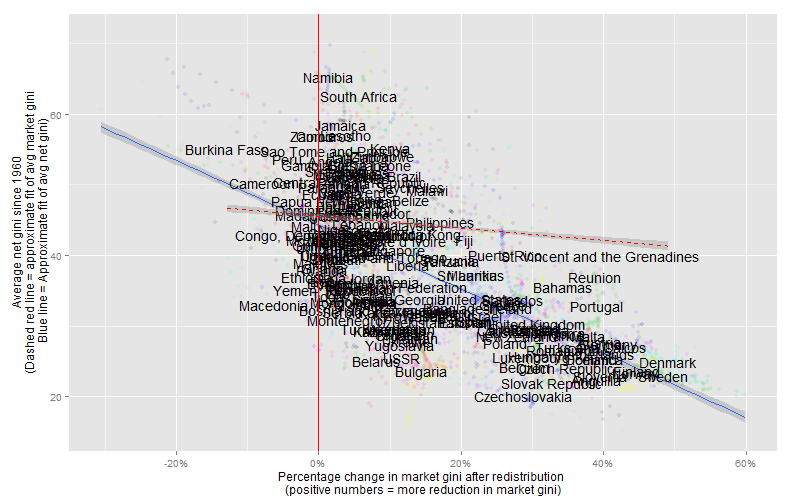

Inequality Regimes: Some thoughts on the evolution of inequality 1960-2010, with special reference to Latin America
========================================================

(Mostly an excuse to play with the [Standardized Worldwide Income Inequality Database](http://myweb.uiowa.edu/fsolt/swiid/swiid.html), compiled by [Frederick Solt](http://myweb.uiowa.edu/fsolt/), which I just discovered. This post also belongs, loosely speaking, to my [long-running series on the quantitative history of political regimes](http://abandonedfootnotes.blogspot.co.nz/search/label/history%20of%20political%20regimes)).

Inequality is difficult to measure. Socially relevant inequalities are manifold, and measurable inequalities in money income are not always especially important. (In the formerly communist states of Eastern Europe income was very evenly distributed yet this did not mean that there were no important social inequalities). Even inequality in money income is not easy to measure properly. Most existing data is not very comparable accross countries or years, and it is often not even clear to what income concept an inequality measure refers to: does it refer to after-tax, after-transfer income or to "market" income? Does it refer to individual or household income? What sorts of things are counted as "income"? How do we account for access to high-quality public services? At best, measures of income inequality are uncertain estimates of an unknown distribution of potential living standards, more or less valid for societies where "money income" is a useful proxy for the ability of people to enjoy various important goods, and of little value outside the context of a conception of a "just distribution" of these capabilities. 

Yet estimates of what is essentially a statistical abstraction play surprisingly big roles in current political debates; they are part of a complex of symbols that can be used to mobilize emotion by standing in for a larger set of more complicated perceived injustices. For example, in NZ, there has been [much concern](http://www.scoop.co.nz/stories/PO1306/S00245/inequality-a-new-zealand-crisis.htm) [about a recent rise](https://www.ipanz.org.nz/Event?Action=View&Event_id=133) in measured income inequality, a concern [echoed](http://abandonedfootnotes.blogspot.co.nz/2010/11/equality-and-domination-footnote-on.html) accross many "developed" countries, and a central assumption of the catchier slogans of the Occupy Wall Street protests; in Venezuela, supporters of the Chavez "Bolivarian revolution" often [point to the fact that measured income inequality appears to have decreased](http://crookedtimber.org/2013/04/09/from-the-mixed-up-files-of-mr-jon-lee-anderson/) during his time in power as a positive outcome of his policies; and critics of capitalism often speak vaguely of "increasing inequality" (especially income inequality) as shorthand for the many ways in which capitalism harms people. And of course inequality is often identified as an important cause of the Arab uprisings, despite the fact that there is [little evidence](http://dartthrowingchimp.wordpress.com/2013/02/03/enough-about-inequality-and-unrest-already/) that income inequality is associated with revolt in general, or with revolt in the Arab world in particular. 

Over time, I have become more skeptical about the importance of income inequality in politics: whatever importance the actual distribution of incomes has in a society, it has to be mediated through complicated processes that refract lived experience through the prism of context-dependent fairness norms. Yet I'm curious: what sorts of income inequality have in fact increased, and where? Even this sort of question is difficult to answer properly, given the low quality of existing data. Enter a new and shiny dataset: the [Standardized Worldwide Income Inequality Database](http://myweb.uiowa.edu/fsolt/swiid/swiid.html), which promises to ameliorate some of these measurement problems. The database uses the [Luxembourg Income Study](http://www.lisdatacenter.org/) - very high quality income inequality data - to calibrate income inequality data for the much larger United Nations University [World Income Inequality Database](http://www.wider.unu.edu/research/Database/en_GB/database/). The result: lovely long time series estimates of both the market and the after tax, after transfer (net) [gini index of inequality](http://en.wikipedia.org/wiki/Gini_coefficient), including standard errors, for 153 countries. You know what's coming: graphs!

One question I've been curious about recently concerns the evolution of inequality in Venezuela relative to other countries, especially since the coming to power of Chavez in 1999. How do changes in inequality in Venezuela compare to changes elsewhere? In the following plot, we see changes in both the market ("equivalized (square root scale) household gross (pre-tax, pre-transfer) income", if you must know) and the net gini index of inequality (after tax, after transfer) in 19 Latin American countries from 1999 until 2010, ordered by the estimated rate of inequality reduction (countries that reduced inequality faster appear earlier; read the graph from right to left, top to bottom):

 

Inequality in Venezuela has indeed decreased relatively quickly since 1999 - the second fastest decrease after Ecuador, which has also had left-leaning governments (though a far more unstable political context, with five different presidents since 1998). Three things are worth noting about the context of these trends, however. 

First is that this reduction in inequality is *not* driven by direct redistribution: there is barely any difference between the "market" gini index (our measure of inequality *before* taxes and transfers) and the "net" gini index (our measure of inequality after taxes and transfers). To the extent that the reduction in inequality is the result of government action, it must have come about through measures like investment in human capital and labor market policies (see [Morgan and Kelly 2012](http://journals.cambridge.org/action/displayAbstract?fromPage=online&aid=8948630), ungated [here](http://web.utk.edu/~nkelly/papers/inequality/MorganKelly%20(2012)%20JOP.pdf)). This is true of all Latin American countries save for Puerto Rico (which is part of the USA in a sense) and (to a lesser extent) Brazil; indeed, redistribution in some countries (Peru) appears to have perversely *increased* inequality. 

Second, most Latin American countries have experienced reductions in inequality during this period, though most remain highly unequal. But Venezuela was *already* among the most equal countries in Latin America; in 1999, only Uruguay and Costa Rica had lower measured inequality (and the difference in net gini was within the margin of measurement error, so it should probably be disregarded). This surprised me; I had expected higher levels of inequality in Venezuela, given the level of class antagonism on display during the Chavez era. 

Finally, Venezuela's rapid reduction in inequality should also be placed in the context of the very large rise in the value of oil and gas during this period. In fact, Venezuela and Ecuador have been precisely the two countries that have benefitted the *most* from oil and gas price increases - money that flows directly to the state and can be used to provide employment and subsidize education, healthcare, housing, staples, and other goods, however inefficiently (e.g., the varios "Misiones" created by the Chavez government). The amount of oil and gas money flowing to the Venezuelan state is quite striking; here is an estimate of the per capita value of oil and gas exports for Latin American countries, from [Michael Ross' oil and gas dataset](http://dvn.iq.harvard.edu/dvn/dv/mlross/faces/study/StudyPage.xhtml?globalId=hdl:1902.1/20369&studyListingIndex=3_c2ec135da1205280fe9a006b68ba), ordered by the average value of such exports:

Yet the low level of inequality in Venezuela as of 2010 only returns Venezuela to the level of inequality it last experienced in 1992, the year of the [February coup](http://en.wikipedia.org/wiki/Venezuelan_coup_attempt_of_1992) which made Chavez famous. The "neoliberal" policies of 1989 (which were supposed to have triggered the [Caracazo](http://en.wikipedia.org/wiki/Caracazo)) appear not to have increased inequality until after 1992 (though they did increase poverty - see below); the Chavez coup in fact came at the end of a long period of inequality reduction and the beginning of a period of increases in inequality, which all goes to show, I suppose, that lived experiences of injustice and inequality are only very loosely connected, if at all, with measures of income inequality: 

   

Basically, inequality in Venezuela has been remarkably stable since, fluctuating around a trend; during the Chavez regime inequality has moved lower.

Let's take a broader look, however. How does the Venezuelan experience of inequality reduction compare to countries outside of Latin America?

 

That's right: Egypt and Turkey apparently reduced inequality faster than Venezuela in this period (though the error estimates of the gini index for both are also larger), and were less unequal than Venezuela by the end of the period! Note also that despite the fact that inequality either did not decrease or increased in the USA and NZ during this period (as measured by the net gini), both countries remain less unequal than Venezuela due to the effectiveness of their redistributive measures (even if their "market" inequality is higher). 

I don't mean to be grudging. It is clear that income inequality has declined faster in Venezuela than in most countries in the world, as we can see by calculating the average rate of change in the net gini coefficient (the slope of a regression of log(net_gini) on year, to be technical) for all countries in the dataset with more than 7 data points in this period:

 

(The error estimates in this graph are probably too small, since one would need to use the proper rules for [error propagation](http://en.wikipedia.org/wiki/Propagation_of_uncertainty) to calculate them, which I have not done. Interestingly, the estimate of the rate of change in the net gini index for New Zealand and the USA since 1998 suggests basically that they have not become more unequal since then, contrary to popular belief; their increases in inequality occurred earlier. More on this in a minute). 

Countries that have achieved very fast reductions in inequality over this period appear to be quite disparate; though leftist governments are in evidence among the countries where inequality has declined fastest, many countries apparently achieved fast reductions in inequality with supposedly "neoliberal" policies (e.g., Egypt and Turkey) that are now in turmoil. Maybe this is evidence that the gini index does not capture important changes in inequality; but then it would also fail to capture changes in inequality in non-neoliberal Venezuela and Ecuador. 

A second point is worth noting: many of the fastest reductions in inequality have occurred in states that do not engage in a lot of explicit redistribution. In fact, a simple correlation between the average redistributive capacity of a state (measured by the percentage difference between the "market" gini and the net gini coefficient) and the rate of decrease in measured "final" inequality over the period is slightly *negative* (fastest reductions in inequality have been achieved in states that are unable to affect market gini very much at all, or that even increase it through perverse redistribution):

 

It's probably not worth making too much of this correlation. When we expand the period of observation all the way to 1960, the correlation basically weakens greatly:

 

In fact, it is striking that the more **directly** and **explicitly** redistributive the state is, the more equal it appears to be over the long run:

 

Or, to put it crudely, since 1960 at least inequality has only been reliably reduced when states **take from the rich and give to the poor**. And yet actually taking from the rich and giving to the poor seems to put nontrivial demands on state capacity (witness the existence of robber states, that take from the poor and give to the rich). The degree of redistribution even appears to be a fair measure of that capacity; from the graph above, it's likely that a state that can consistently reduce gini index of market inequality by at least 30% is a pretty "strong" state (in the "[infrastructural](http://www.sscnet.ucla.edu/soc/faculty/mann/Doc1.pdf)" sense of strong), whereas a state that cannot make a dent on the market distribution of income is more likely to be "weak" (with some communist exceptions that did not engage in a great deal of explicit redistribution, since the state owned everything and everyone more or less got paid the same).
